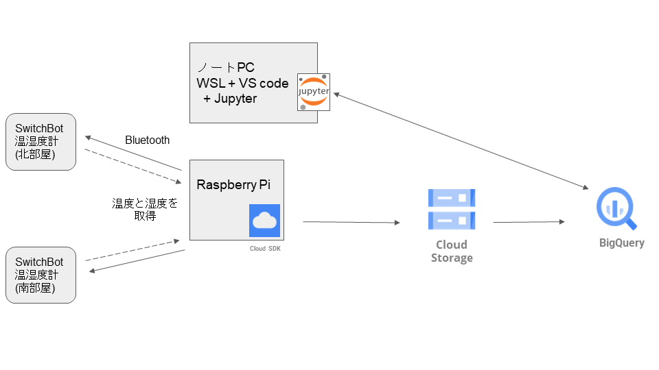

# switch-bot-meter-jupyter-big-query

## 概要

BigQueryに格納したデータを、ローカルPCのJupyter Notebookで取得して可視化。

データはSwitchBot温湿度計で取得した温度。

## 環境

- ノートPC、WSL、VS code(+Python拡張機能)、Jupyter
- BigQuery
   - サービスアカウントキー(jsonファイル)で認証

構成図



以下のpipをインストール。
```
$ pip3 install --upgrade pydata-google-auth
$ pip3 install --upgrade 'google-cloud-bigquery[bqstorage,pandas]'
$ pip3 install --upgrade google-cloud-storage
```
不要なもの、不足しているものがあるかも。

インストールに失敗した場合。
```
$ pip3 install --upgrade pip setuptools
```

## 参考

BigQuery Storage API を使用して BigQuery データを pandas にダウンロードする  
https://cloud.google.com/bigquery/docs/bigquery-storage-python-pandas?hl=ja

google-auth  
https://google-auth.readthedocs.io/en/latest/user-guide.html#obtaining-credentials

BigQuery + jupyterで機械学習を行う(その1: データセットの作成)
https://qiita.com/Hase8388/items/3d7da2166b5bc495879f


